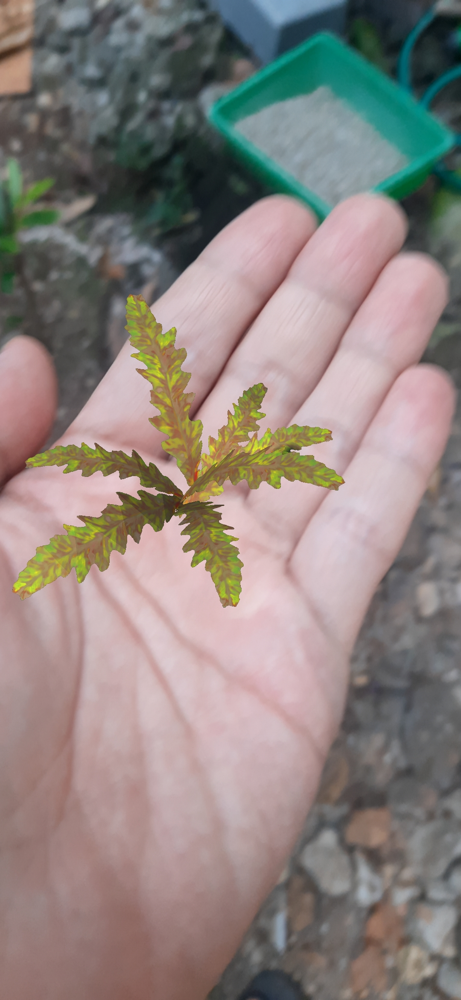

# An Augmented Reality Experiment

## Overview
An AR project to getting started with AR Mobile Application from scratch.

Since I'm familiar enough with Unity, I was simply search any beginner-friendly tutorial to quickly dive into AR technology, so here is the [tutorial](https://youtu.be/FJAO6jDYljs?si=HyBFwsbiZpg98I9A) from freeCodeCamp.org. 
AR techonology implementation looks intimidating until I've got the right tools and plugins, so I decided to move along with this tutorial. I was never expected that setting up AR mobile application from scratch was that simple!

The biggest challange I've got so far was found the deprecated package's content due to outdated AR Foundation version, but fortunately the kind author update the code for the latest version. The second one was to make sure the build application is working properly, meanwhile my smartphone's camera not good enough to support the best lighting setup, so I've got to go outdoor for plane detection based AR like [AR Gardeni]() and [AR Furnish]().

## What I've learned
* AR Mobile Application implementation concept.
* Setting up mobile platform from scratch with Unity.
* Improve AR Mobile Application to be interactive and immersive.
* Basic C# for AR Mobile Application.

## What the AR Apps looks like
1. AR Earth and Mars  
Rotating Earth and Mars on the go. 

2. AR Jet Turbine  
Such a machine "learning". 

3. AR Gardeni  
Plan the Plants on the Plane. 

4. AR Furnish  
Imagine the furniture. 

## Credits
* [freeCodeCamp.org](https://www.youtube.com/@freecodecamp): for the awesome YouTube tutorial.
* [Priyanshu Bhattacharjee](https://github.com/Priyanshu-CODERX): the author of the user friendly tutorial.
* [Hillary Nyakundi](https://github.com/larymak): extraordinary guide to writing a good readme file. [how-to-write-a-good-readme-file](https://www.freecodecamp.org/news/how-to-write-a-good-readme-file/).
* You: for reading this readme :)